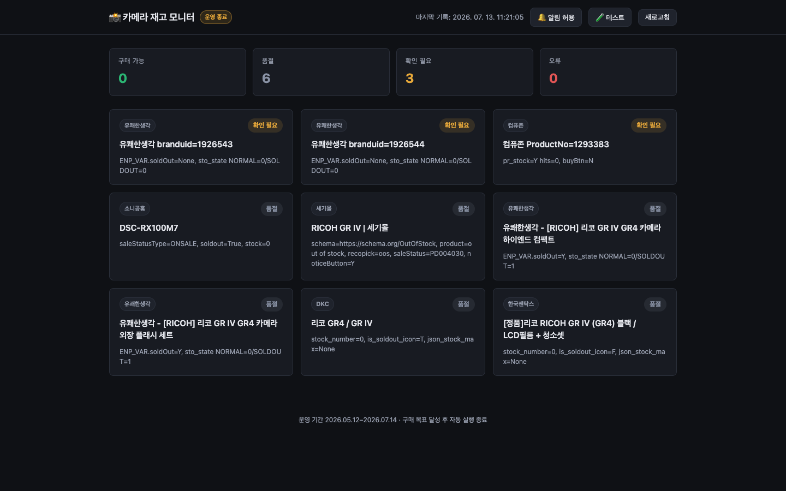
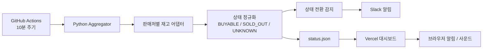

# Camera Stock Monitor

여러 국내 판매처에 흩어진 한정 재고 카메라를 자동 확인하고, 구매 가능한 순간을 Slack과 웹 알림으로 전달한 개인 자동화 프로젝트입니다.

> **운영 상태: Archived**
>
> 2026년 5월 12일부터 7월 14일까지 운영했고, 실제 구매 목표를 달성해 예약 모니터링을 종료했습니다. [최종 대시보드 스냅샷](https://camera-kappa-taupe.vercel.app)은 포트폴리오용으로 남겨두었습니다.



## 프로젝트 요약

| 항목 | 내용 |
| --- | --- |
| 문제 | 인기 카메라의 소량 재입고가 여러 쇼핑몰에서 불규칙하게 발생하고 빠르게 품절됨 |
| 목표 | 터미널을 계속 보지 않아도 재고 전환을 빠르고 정확하게 감지 |
| 범위 | 최종 기준 6개 판매처, 9개 상품 |
| 자동화 | GitHub Actions 10분 주기 실행, 상태 스냅샷 자동 갱신 |
| 알림 | `SOLD_OUT → BUYABLE` 전환 시 Slack, 로컬 시스템 알림음, 브라우저 알림 |
| 결과 | 약 2개월 실운영 후 목표 상품 구매 성공, 2026-07-14 운영 종료 |
| 기술 | Python, Requests, BeautifulSoup, GitHub Actions, JavaScript, Vercel |

## 해결 구조



판매처마다 재고 표현이 달랐기 때문에 단순히 `품절` 문구 하나를 찾지 않았습니다. JSON-LD availability, 재고 수량, 판매 상태, 구매 버튼과 입고 알림 버튼 등 복수 신호를 사이트별로 해석한 뒤 공통 상태로 정규화했습니다.

## 핵심 문제 해결

- **사이트별 HTML 차이**: 캐논·소니·네이버·세기몰·Makeshop·Cafe24 계열에 맞는 파서를 분리했습니다.
- **차단과 네트워크 장애 구분**: HTTP 403/429는 백오프하고 DNS·timeout·route 오류는 재시도 가능한 네트워크 장애로 분류했습니다.
- **오탐 방지**: 일시 장애 시 직전 정상 상태를 유지하되 `stale`로 표시했고, 장애 문구가 반복 누적되지 않도록 원본 정상 상태를 고정했습니다.
- **알림 피로 감소**: 매 polling마다 알리지 않고 `BUYABLE`로 바뀌는 순간에만 Slack을 전송했습니다.
- **로컬 의존성 제거**: 맥북 터미널 실행에서 GitHub Actions와 Vercel 기반 무인 운영으로 확장했습니다.
- **크로스 플랫폼**: macOS 알림음과 Windows UTF-8 콘솔·시스템 알림을 각각 지원했습니다.

## 결과와 배운 점

기능 구현 자체보다 실제 운영 중 발생하는 429, DNS 실패, 사이트별 인코딩, 일시적인 잘못된 상태 전환을 구분하는 일이 더 중요했습니다. 이 프로젝트를 통해 웹 스크래핑을 “HTML을 읽는 코드”가 아니라 **불완전한 외부 신호를 신뢰 가능한 상태로 변환하는 시스템**으로 다루게 됐습니다.

최종적으로 사용자가 계속 화면을 지켜보지 않아도 되는 흐름을 만들었고, 실제 구매에 성공하면서 프로젝트의 종료 조건까지 달성했습니다.

## 문서

- [프로젝트 히스토리와 의사결정](docs/PROJECT_HISTORY.md)
- [이력서·면접용 정리](docs/RESUME_NOTES.md)

## 저장소 구조

```text
aggregator/                     전체 판매처 실행, 상태 정규화, 전환 알림
mac-camera-stock-monitor/       macOS용 캐논·소니·네이버 모니터
windows-camera-stock-monitor/   Windows용 모니터와 실행 배치파일
saeki-gr4-stock-monitor/        세기몰 RICOH GR IV 전용 모니터
plthink-ricoh-stock-monitor/    Makeshop·Cafe24 계열 판매처 모니터
web/                            Vercel 정적 대시보드
status.json                     마지막 운영 상태 스냅샷
```

## 재현 방법

프로젝트는 종료됐지만 수동 실행은 보존했습니다.

```bash
python3 -m pip install -r aggregator/requirements.txt
python3 aggregator/check_all.py
```

Slack을 사용하려면 로컬 환경 변수 또는 GitHub Secret에 `SLACK_WEBHOOK_URL`을 설정합니다. 실제 Webhook URL과 `.env` 파일은 저장소에 포함하지 않습니다.
